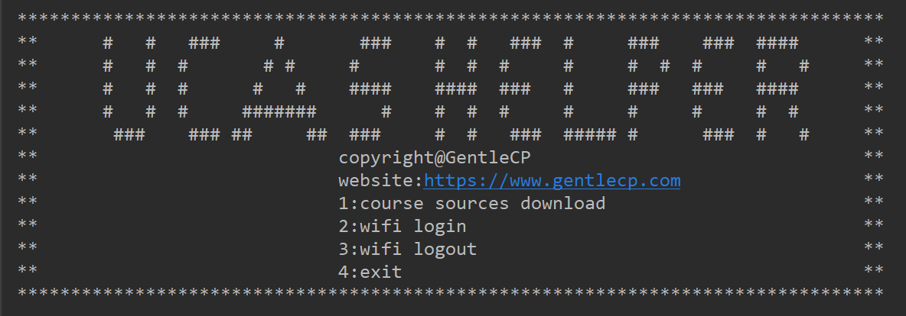
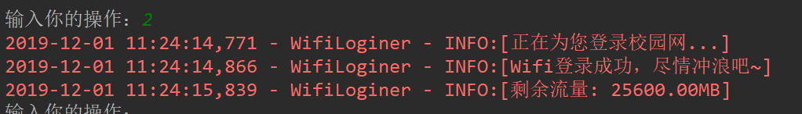
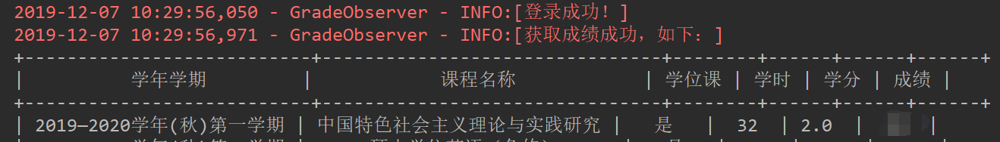
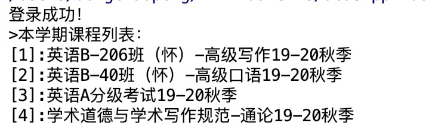
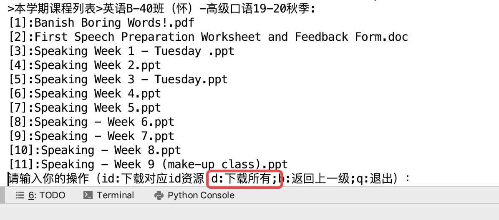
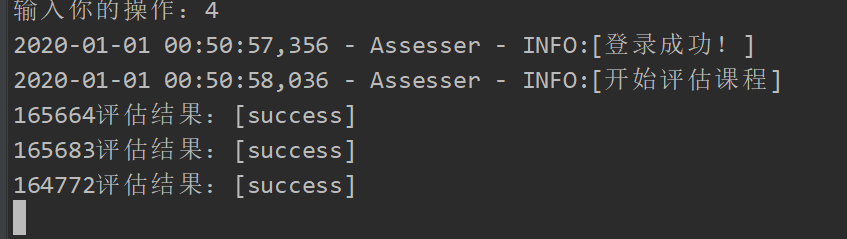

# UCAS Helper


```angular2
*********************************************************************************
**      #   #   ###     #       ###    #  #   ###  #     ###    ###  ####      **
**      #   #  #       # #     #       #  #  #     #     #  #  #     #   #     **
**      #   #  #      #   #    ####    ####  ###   #     ###   ###   ####      **
**      #   #  #     #######      #    #  #  #     #     #     #     #  #      **
**       ###    ### ##     ##  ###     #  #   ###  ##### #      ###  #   #     **
**                            copyright@GentleCP                               **
**                            version: x.x.x                                   **
**                github: https://github.com/GentleCP/UCASHelper               **
**                            1:course sources download                        **
**                            2:wifi login                                     **
**                            3:wifi logout                                    **
**                            4:course assess                                  **
**                            5:query grades                                   **
**                            q:exit                                           **
*********************************************************************************
```
目录
=================
   * [前言](#前言)
   * [1. 功能介绍](#1-功能介绍)
   * [2. 更新日志](#2-更新日志)
   * [3. 作者信息](#3-作者信息)
   * [4. 效果预览](#4-效果预览)
   * [5. 使用教程](#5-使用教程)
   * [6. 问题反馈](#6-问题反馈)

# 前言

原本只是一时兴起，为了方便写的UCAS课程网站小助手，帮助我自己进行课程资源快速同步。没想到后面随着功能的增加，项目也变得小有规模起来，因此将其开放给全体UCAS同学，小助手的使用方式在下面有介绍，十分简便（需要一点对`python`环境的了解，百度`python`的安装即可），如果你觉得本项目对你有所帮助的话，希望你能帮我点个star，算是对作者的一点激励吧～ 感谢每一个为项目点上`star`，让更多人看到这个项目的人。❤️

> 注意：由于课程网站的变动可能引发脚本失效，在失效后，我会尽量及时修复bug，并更新版本到github，建议star项目方便接收更新消息，或者在失效时查看本项目[github链接](https://github.com/GentleCP/UCASHelper)。

# 1. 功能介绍
- [x] 课程资源同步
- [x] 课程评教
- [x] 成绩查询
- [ ] 校园网登录/登出
- [ ] 校园网账号破解

>  `校园网`相关功能因缺乏校园网环境无法维护确认，感兴趣的可以提交PR:)
 
[点击这里](docs/functions.md)查看详细功能介绍

# 2. 更新日志
[点击这里](docs/change_log.md)查看更新日志

# 3. 作者信息
- name: 董超鹏
- nickname: GentleCP
- e-mail: 574881148@qq.com
- website: https://www.gentlecp.com

# 4. 效果预览
- 小白使用窗口  
    
- 自动登录校园网  
    
- 校园网账号破解  

- 自动查分  
    
- 显示本学期课程列表  
    
    
- 同步所有课程资源到本地  
    
- 同步指定课程的资源到本地      
    
- 同步指定课程的指定一个资源到本地  
  
- 自动评估课程和教师  
    

# 5. 使用教程

[点击这里](docs/usage.md)查看使用教程

# 6. 问题反馈
- `issue`：提交前请先确认是否已有相似的`issue`，尝试自己解决。
- 提问方式：请详细描述你遇到的问题，具体包括:
    1. 使用的版本（绝大多数问题通过更新到最新版本可以解决）
    2. 产生问题的功能（哪个具体功能出现了使用问题）
    3. 问题的具体描述（例如**分数查询时长时间卡顿，没有显示结果**，最好配上截图）

如果你发现了问题，并自己解决修复了，希望你能提交PR，作为贡献者帮助完善这个项目。

# 7.TODO
- [ ] 一个全新的交互界面，有时间再写