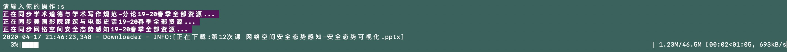
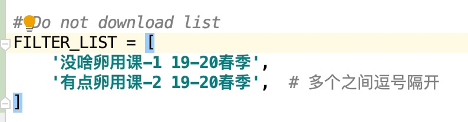
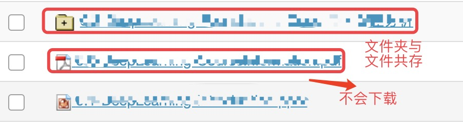

更新日志
===========
- [2.3.0] 添加引导配置程序，将`settings.py`中用户信息和存储信息单独存，解耦合，新版本依赖`npyscreen`，请执行`pip install -r requirements.txt`
- [2.2.0] 添加专门的日志处理器，优化部分代码结构
- [2.1.2] 更改了文档信息，将主要内容单独拎出来，简化README。 
- [2.1.1] 本次做了两个主要改动：
    1. 添加了自动更新的功能，在每次程序启动的时候检测github上的最新代码，若有更新，则同步更新，具体见[5.5 更新项目](#55-更新项目)
    2. 修改了资源存储位置检测的顺序，放到了程序主界面启动之后，这样可以避免只想使用其他功能的朋友被强制要求设定资源下载路径
- [2.0.5] 修复登陆接口请求失败的问题,建议使用最新的更新方式，见[5.5 更新项目](#55-更新项目)
- [2.0.4] 修复评估教师失败的bug
- [2.0.3] 修复了部分课程因html解析不当导致的课程资源无法下载的情况，本次更新需要用到新的依赖包`lxml=4.5.2`，
已安装老版本的请重新执行`pip install -r requirements.txt`
- [2.0.2] 修复了因课程网站选课系统添加头部检查导致的**课程评估，分数查询**功能的失效。
- [2.0.1] 对整体代码进行了重构，解决因课程网站`http`,`https`协议切换导致的访问出错问题，
同时更改了项目接口，方便小白和专业人士操作。以前均通过可视化`UI`界面进行操作，现在用户可选择`UI`和命令行两种模式，具体见**5.部署使用**。
对各个功能测试结果如下：
    - [x] 课程资源同步
    - [x] 分数查询
    - [ ] 自动评教：由于课程网站评教操作关闭，尚未测试
    - [ ] 校园网登录：由于不在学校，尚未测试
    - [ ] 校园网账号破解：同上
    > 未测试内容基本上沿用了之前的代码，按照常理不会出错，如果有问题，欢迎提出`issue`
  
- [1.7.2] 修复了因课程主站使用http协议导致的错误  
    > GKD的课程主站偶尔抽风，一会用https，一会用http，导致访问端口出现问题，现统一将用到的url放到`settings.py/URLS`中，
    当主站修改应用协议时修改对应url的协议即可。例如`'base_url':'http://jwxk.ucas.ac.cn'`>`'base_url':'https://jwxk.ucas.ac.cn'`,
    目前没时间完美适配这个问题（对代码重构较多）。
- [1.7.1] 修改了主页的部分显示内容，添加版本信息，去除网站链接
- [1.7.0] 添加了分数查询功能并修复了课程评估失败的问题
- [1.6.0]  文件同步添加了进度条，方便查看文件同步信息，但请注意，若下载过程中未完成中断任务需将下载一半的文件删除，否则不会更新
    
- [1.5.1]  修复下载全部课程资源时没有打开文件目录的选项问题，当无更新的时候自动退出应用
  
- [1.5.0]  具体如下：
    
    - 课程资源同步后有新的资源时会提示是否开启资源所在目录，简便查看文件操作，如下：
        
    - 允许添加不希望被同步的课程内容：在同步所有的时候有一门课的资源并没什么卵用，但为了一门而去一个个同步其他的又略显麻烦，因此添加了一个`FILTER_LIST`，存放不想被同步的课程目录。打开`settings.py`，找到`FILTER_LIST`，将不想被同步的课程全名（如`没啥用课19-20春季`），添加到列表当中，如下：
      
    
    - 新版本在同步更新完成后会自动退出，不需要再手动退出程序
    
- [1.4.3]修复了当同时存在多个文件夹和文件时不会下载与文件夹同目录的文件的问题，如下图所示：
    
    
- [1.4.2]  解决了当课程网站存在文件夹时无法获取到课程资源同步的问题，一开始并未考虑到老师创建文件夹
  
- [1.4.1]  在课程资源选项中可以选择仅同步某个学期(春季，夏季，秋季)课程