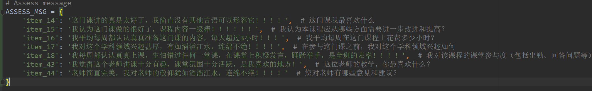
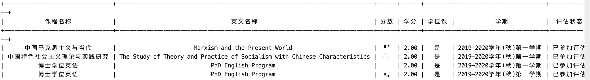

功能介绍
=================

   * [课程资源同步](#课程资源同步)
   * [wifi登录与破解](#wifi登录与破解)
   * [课程评估](#课程评估)
   * [分数查询](#分数查询)

# 课程资源同步
国科大的课程网站在高校中已经算是很便利的了，老师可以发布ppt或其他课程资源到网站上，学生可以登录课程网站下载需要的资源，但唯一让我感觉不爽的就是每个资源（如ppt），只能一个个单独下载，没有批量下载的选项。另一方面，每次网站发布了新的资源，我都要登录课程网站一个个点，真的心累。要是有个脚本可以直接将我本地的课程资源，与课程网站一键同步就好了。所以就写了一个可用自动同步所有课程资源到本地的项目。

> 现在可以按照学期同步自己需要的资源，而不用将之前学期的一并同步

# wifi登录与破解
提供了自动登录的功能，且允许添加多个账号，当一个账号流量使用完后，可用下一个账号自动登录，每月自动更新。出于隐私保护，项目不直接提供爆破的账号密码信息（以防被外来人员利用），在校学生可参考**5.部署使用**，破解新的账号。
> 爆破需在校园网环境下，请确保你已正确连接校园网（建议有线）且未登录校园网。
爆破时间较长（慢的时候2-3个小时），因此建议晚上睡觉的时候开启，
早上的时候一般已经爆破完成1-2个账号。

- 校园网对单个设备登录有限制，因此多进程的速度与单进程差别不大
- 一个账号流量有25GB，因此一般破解1-2个账号加上自己的就够个人使用了
- 对于破解的账号，请**不要修改密码**，方便自己也方便他人:)
- 当然你也可以直接找要好的师兄师姐，借用他们的账号添加到accounts.json中，
省时省力QAQ
- 破解的账号都是往年的已经离开雁栖湖回所的师兄师姐的！
**请不要利用本项目对还在雁栖湖上课的同学的账号进行破解！！！**

# 课程评估 
新增了课程评估的功能，在主界面中选择4即可进行课程评估，评估的等级默认选择5，因为会用脚本评估的大多是怕麻烦的人，如果有个别老师或课程让你觉得十分不靠谱，根本无益，建议还是手动去修改下对应的评估，虽然不知道是否真的对教改有用，起码得让那课程老师心里有点数呀~
> 评估之前请进入`settings.py`修改一下主观评估的内容，别都和我评估一样了喂~

# 分数查询
分数查询功能重新上线！现在可以在程序主页选择功能5(query grades)来查询自己的所有成绩，显示效果如下：

